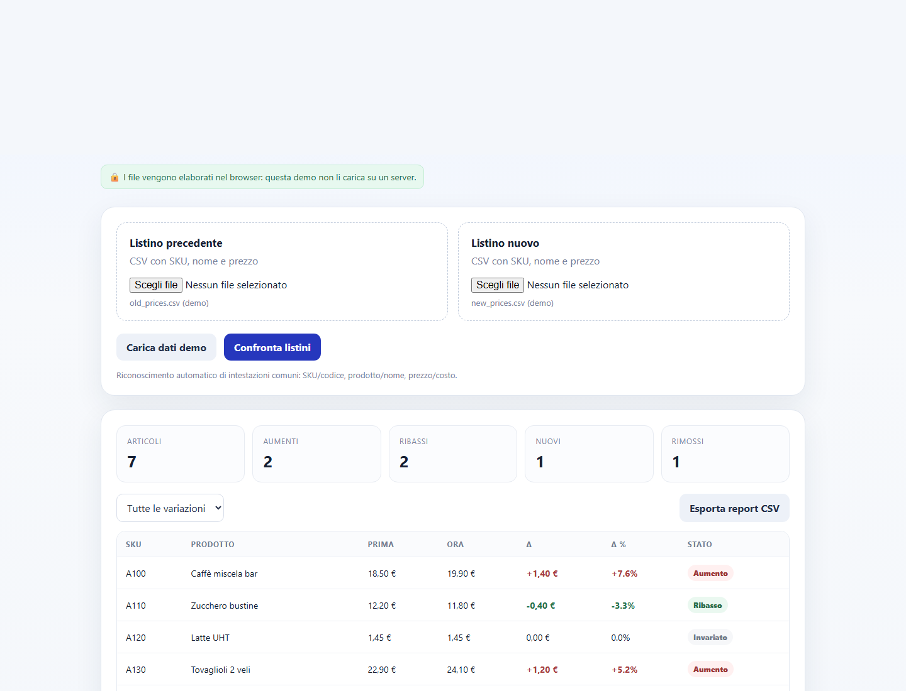

# ListinoDiff

Demo portfolio gratuita per confrontare due listini CSV e individuare automaticamente aumenti e ribassi di prezzo, nuovi articoli, prodotti rimossi e articoli invariati.

**Demo online:** https://ago993.github.io/listinodiff-demo/



## Perché esiste

È un esempio di automazione semplice per piccole imprese e professionisti che gestiscono listini o file tabellari manualmente.

## Funzioni

- confronto tra listino precedente e nuovo;
- variazione assoluta e percentuale;
- filtri per aumenti, ribassi, nuovi, rimossi e invariati;
- esportazione del report in CSV;
- riconoscimento di intestazioni comuni in italiano e inglese.

## Privacy

L'elaborazione avviene interamente nel browser. I file selezionati non vengono inviati a un backend da questa demo.

## Formato supportato

Sono richieste almeno una colonna identificativa e una colonna prezzo. La demo riconosce automaticamente nomi comuni come `sku`, `codice`, `id`, `nome`, `prodotto`, `descrizione`, `prezzo`, `costo` e `price`.

## Avvio locale

```bash
python -m http.server 8000
```

Poi apri `http://localhost:8000`.

## Test

```bash
node tests/test_core.js
```

## Stack

HTML, CSS e JavaScript puro. Nessun framework e nessuna dipendenza runtime.

## Nota

Questa è una demo dimostrativa. Un progetto reale verrebbe adattato al formato dati, alle regole e ai controlli richiesti dal cliente.
